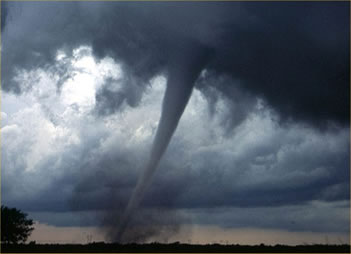

# INTERNACIONAL

# Escola Gildo Veríssimo
# Disciplina: Português
# Professor: Marcos
# Aluno: Julio Cavalcanti
# Turma: 8°B
---
---
# Desastre
---
---

Imagens de satélite no início da tarde desta terça-feira (27) sugerem que o furacão Ian — atualmente de categoria 3 com ventos de 193 km/h — está se fortalecendo à medida que se move para as águas ultraquentes do Golfo do México.

---
Meteorologistas notaram que poderia estar entrando em outro período de rápida intensificação.

---
A intensificação rápida é exatamente o que parece — os ventos de um furacão se fortalecendo rapidamente em um curto período de tempo. Os cientistas definiram como um aumento da velocidade do vento de pelo menos 56 km/h em 24

---

